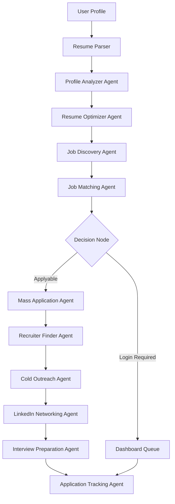
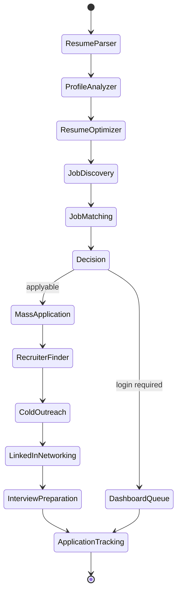
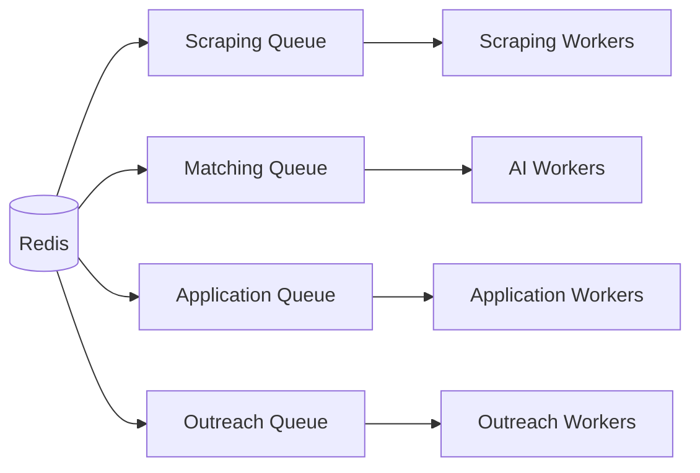
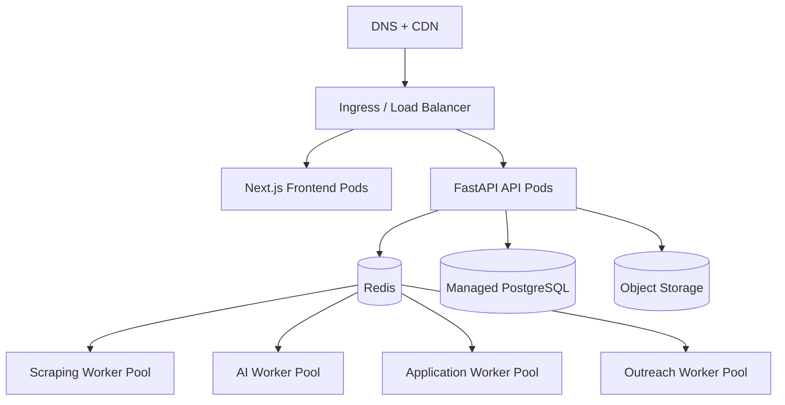

# ApplyEngine Architecture

## 1. System Architecture Diagram

```mermaid
flowchart LR
  user[User] --> web[Next.js Dashboard]
  web --> api[FastAPI Control API]
  api --> auth[Auth + Onboarding]
  api --> graph[LangGraph Orchestrator]
  api --> db[(PostgreSQL)]
  api --> redis[(Redis / Celery)]
  api --> s3[(S3 Compatible Storage)]
  graph --> agents[AI Agent Registry]
  graph --> scrape[Distributed Scraping Engine]
  graph --> apply[Mass Application Engine]
  graph --> outreach[Outreach + LinkedIn]
  scrape --> redis
  apply --> redis
  outreach --> redis
  redis --> workers[Worker Clusters]
  workers --> jobs[Job Sources]
  workers --> email[Email Provider]
  workers --> proxy[Proxy / CAPTCHA]
  workers --> linkedin[LinkedIn]
```

## 2. LangGraph Architecture Diagram



## 3. LangGraph State Machine



## 4. Worker Cluster Architecture



## 5. GitHub Repository Structure

```text
applyengine/
|-- backend/
|   |-- applyengine/
|   |-- tests/
|-- frontend/
|   |-- app/
|   |-- components/
|   |-- lib/
|-- docs/
|-- infra/
|   |-- docker/
|   |-- k8s/
|   |-- cloud/
|-- loadtests/
|-- scripts/
|-- docker-compose.yml
|-- pyproject.toml
```

## 6. Backend Folder Structure

```text
backend/applyengine/
|-- agents/
|-- api/
|   |-- v1/
|-- core/
|-- db/
|-- graphs/
|-- repositories/
|-- schemas/
|-- services/
|-- workers/
|-- main.py
```

## 7. Frontend Folder Structure

```text
frontend/
|-- app/
|   |-- globals.css
|   |-- layout.tsx
|   |-- page.tsx
|-- components/
|   |-- dashboard-shell.tsx
|-- lib/
|   |-- api.ts
|-- package.json
|-- tailwind.config.ts
```

## 8. Deployment Architecture



## 9. Local Development

```bash
python -m venv backend/.venv
source backend/.venv/bin/activate
backend/.venv/bin/python -m pip install -e .[dev]
backend/.venv/bin/python -m unittest discover -s backend/tests -v
backend/.venv/bin/python -m applyengine.main
```

```powershell
python -m venv backend\.venv
.\backend\.venv\Scripts\Activate.ps1
.\backend\.venv\Scripts\python.exe -m pip install -e .[dev]
.\backend\.venv\Scripts\python.exe -m unittest discover -s backend\tests -v
.\backend\.venv\Scripts\python.exe -m applyengine.main
```

## 10. Docker

```powershell
docker compose up --build
```

## 11. Kubernetes Autoscaling Strategy

- Scale scraping workers on queue depth and CPU.
- Scale application workers on queue depth, CPU, and browser session saturation.
- Keep AI workers on tighter memory-based HPA thresholds because embedding and LLM tasks are memory heavy.
- Use separate node pools for browser automation, CPU-heavy matching, and API pods.

## 12. Testing Strategy

- Unit tests: auth, parsing, matching, deduplication, dashboard aggregation
- Agent tests: profile analyzer, resume optimizer, login detection, recruiter/outreach generation
- Integration tests: workflow orchestration and application execution across repositories
- Load testing: Locust scenario targeting 1000 applications/day per user using staged concurrency

## 13. Validation Commands

```bash
# Backend tests
backend/.venv/bin/python -m unittest discover -s backend/tests -v

# Worker tests
backend/.venv/bin/python -m unittest backend.tests.test_worker_queues -v

# API tests
backend/.venv/bin/python -m unittest backend.tests.test_app_spec backend.tests.test_application_execution -v

# LangGraph flow validation
backend/.venv/bin/python scripts/validate_graph.py
```

```powershell
# Backend tests
.\backend\.venv\Scripts\python.exe -m unittest discover -s backend\tests -v

# Worker tests
.\backend\.venv\Scripts\python.exe -m unittest backend.tests.test_worker_queues -v

# API tests
.\backend\.venv\Scripts\python.exe -m unittest backend.tests.test_app_spec backend.tests.test_application_execution -v

# LangGraph flow validation
.\backend\.venv\Scripts\python.exe scripts\validate_graph.py
```
